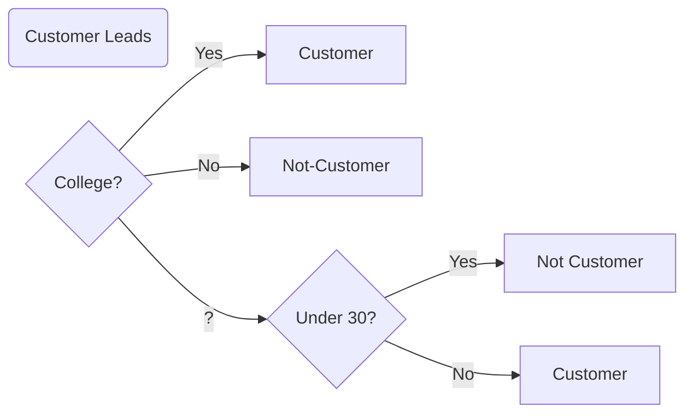

### Introduction

In previous lessons, we learned about some of the general characteristics of machine learning algorithms.  We learned that:

1. Unlike in a traditional programming, machine learning helps us to discover the underlying procedure that predicts an outcome. 
2. We also learned about the general machine learning procedure - gather some training data, and use an optimization procedure that finds a hypothesis function that comes close to predicting the training data.

Over the next few lessons, we'll see this procedure applied to decision trees.

Let's start with our data, and then we'll move onto the hypothesis function for decision trees.

### Our Data

Imagine we are in the business of selling real estate. We take a look at our past data to try to learn which types of customers are likely to buy our real estate. We see the following past data of customer leads.

| Attended College | Under Thirty | Borough   | Income | Customer |
| ---------------- | ------------ | --------- | ------ | :------: |
| ?                | Yes          | Manhattan | < 55   |    0     |
| Yes              | Yes          | Brooklyn  | < 55   |    0     |
| ?                | No           | Brooklyn  | < 55   |    1     |
| No               | No           | Queens    | > 55   |    1     |
| ?                | No           | Queens    | < 55   |    1     |
| Yes              | No           | Queens    | >55    |    0     |
| Yes              | No           | Queens    | >55    |    0     |
| Yes              | Yes          | Manhattan | >55    |    0     |

Remember that each row of our data is an *observation*, and that each observation consists of feature data and a target.  Here, our target is *customer*.  The rest of the columns are the features that predict whether someone becomes a customer or not.

So, just looking at the first row,  we see that we do not know if the lead attended college, she is under 30, from Manhattan, makes under 55k, and did not become a customer.

### The answer

As we know, in machine learning, we'll use this training data to arrive at our hypothesis function that comes close to predicting our outcomes.  Let's just skip ahead to the best fit hypothesis function.  Later we'll learn the process for arriving there.  This our best decision tree hypothesis function for the above training data.

The above is our decision tree. It tells us how to predict if a lead will turn into a customer or not.  At each diamond, we ask a question, going from left to right.  

Let's try it out on a new lead to see how we can use it to make a prediction.

| Attended College | Under Thirty | Borough   | Income |
| ---------------- | ------------ | --------- | ------ |
| ?                | No           | Manhattan | < 55   |

Looking at our decision tree, our decision tree tells us to first look at college.  Because in our example above, college has a value of ?, we follow the branch to the under thirty diamond.  This tells us to ask another question.  Because our lead is not under thirty, we follow the No branch, and predict the lead will become a customer.

