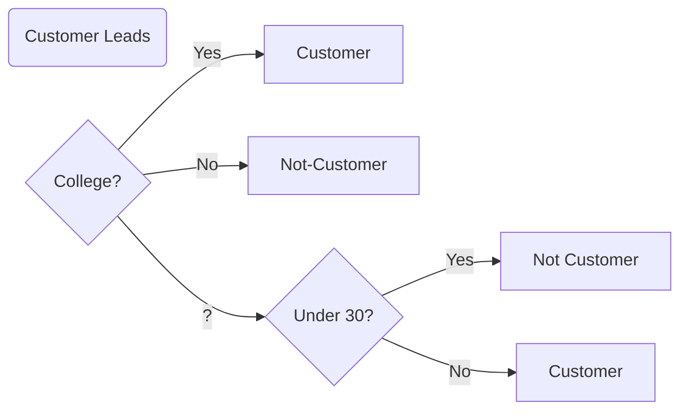

Let's take another look at our tree. Trees are an important structure not just in data science, but in computer science. They are very effective way to organize information.




Each of the diamonds or squares is a **node**. So college is a node, as is under 30? Each of the lines is called an **edge**, but we can also think of it as a branch of tree. When our node does not have an edge, we call this a **leaf node**. We can also think of our decision tree as having a **depth**, which above is just three.

### Decision Trees: Another view 

One question we may have is, how do we turn this into code? 

Notice that our decision tree is really just a series of if else statements in Python. We could write this as the following Python code:

For example, imagine that we have the following customers.  Try to write out an `if else` statement in Python that will return 1 if the person becomes a customer and 0 if the person does not.

```python
customer_1 = {'college': True, 'under_thirty': False}
customer_2 = {'college': False, 'under_thirty': True}
```

We'll get you started.

```python
def decision_tree(customer):
  if customer['college'] == True:
    return 1
  # fill in the rest
```

### Summary 

In this lesson, we learned about decision trees. We saw that decision trees can provide us with a series of tests that allow us to predict whether a datapoint will fall into one category or another. In the next lesson, we'll see how to train our decision trees.