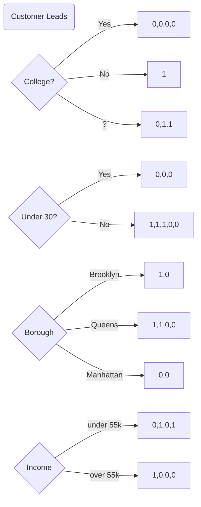
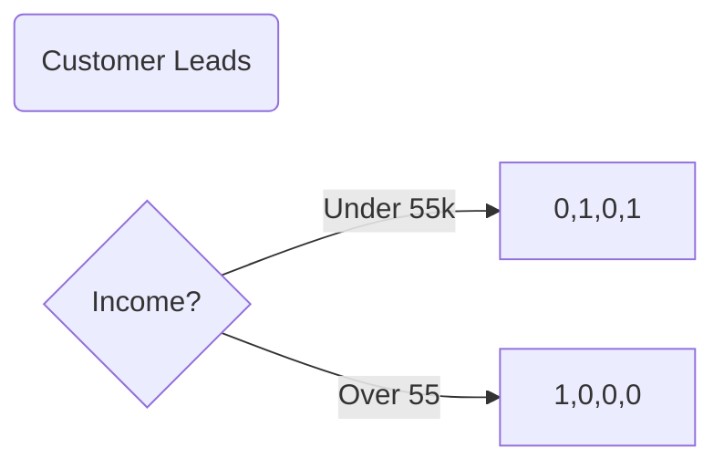
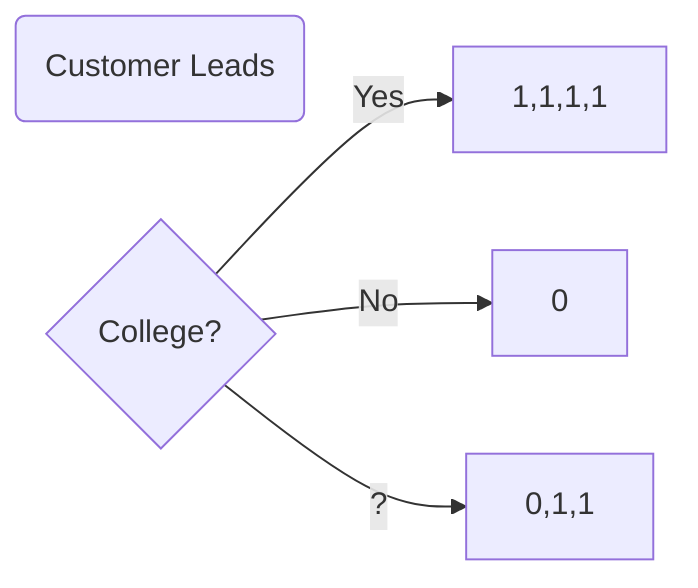
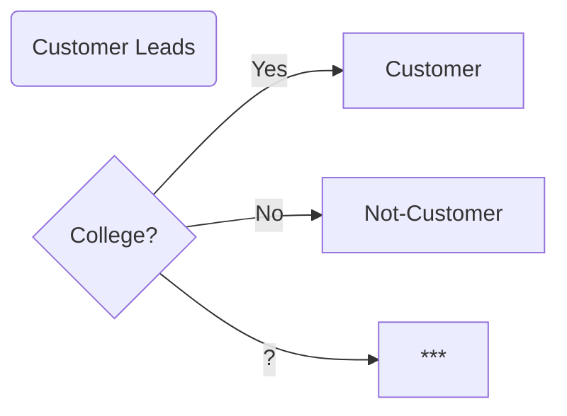

#### 1. Split the data according to each feature

Let's take another look at our first steps.

```
Given a subset of data
For each feature in our dataset
	○ Split the data according to the feature
	○ Compute consistency of data in each split 
```

When beginning our process we don't use a subset of data, but our entire dataset, and then split the data for along each feature. We have the splits below, as well as how it splits the data into customers and non-customers. (The 1 represents a customer, and 0 represents a non-customer.)




Looking at the splits above, we see some splits do a fairly good job of segmenting our leads into customers and noncustomers. Others, not so much.

#### 2. Compute consistency of data in each split 

So the next step, is to compute the consistency in each split. That is, we want to choose the test that best separates our leads into customers and non-customers. After all, if we test whether leads earn less than 55k, and we find the same proportion of customers and non-customers as we started with, this test didn't help us predict the future outcome.

For now, we'll rank each test by counting the number of leads that the test places into a homogeneous group (that is, a group where all are either a customer, or all or either not.).

Take a look at the diagrams below.

> The income test scores a zero as there are no leads in a homogeneous group.




> The college test does the best across all of our features with a score of a five.




#### 3. Choose the feature with the highest consistency 

Because the college test scores the highest across all of our features, we start with using college to predict whether or not someone will become a customer.

- If a lead attended college, we predict they will become a customer. 
- If they did not attend, we predict that they will not become a customer.
- And when we see a question mark for college, we do not yet make a prediction. 

So we just turned our above data into a hypothesis as to our future outcomes.  In other words we started with this.


And turned it into this.



The diagram is the beginning of a decision tree. It isn't yet finished, as it does not make a prediction about leads who do not provide us with college information. So to make predictions about these leads, we again look at our data to continue training our decision tree.