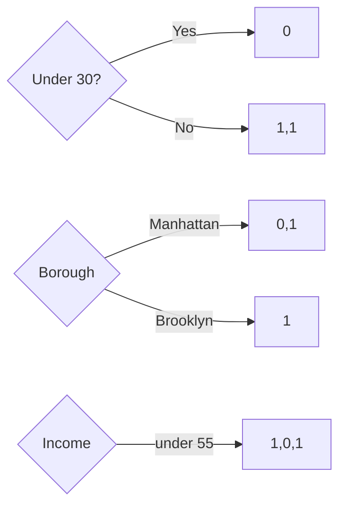
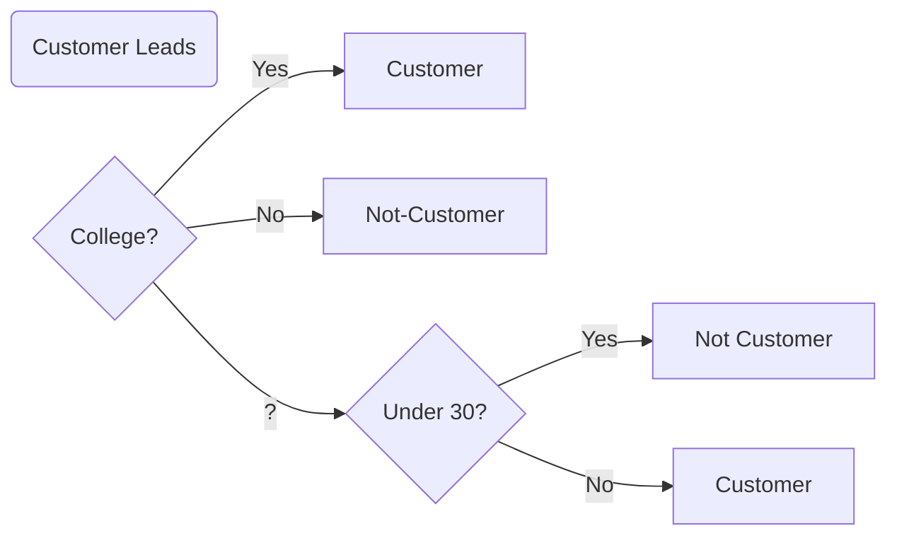

#### 4. Repeat for remaining subset

Looking at our training data, we see that we have three observations with question marks next to attended college, and these are the observations that we cannot yet make a prediction for.

| Attended College | Under Thirty | Borough   | Income | Customer | Customer Predictions |
| ---------------- | ------------ | --------- | ------ | :------: | -------------------- |
| ?                | Yes          | Manhattan | < 55   |    0     | ?                    |
| Yes              | Yes          | Brooklyn  | < 55   |    0     | 1                    |
| ?                | No           | Brooklyn  | < 55   |    1     | ?                    |
| No               | No           | Queens    | > 55   |    1     | 0                    |
| ?                | No           | Queens    | < 55   |    1     | ?                    |
| Yes              | No           | Queens    | >55    |    0     | 1                    |
| Yes              | No           | Queens    | >55    |    0     | 1                    |
| Yes              | Yes          | Manhattan | >55    |    0     | 1                    |

So the next thing we do focus on the remaining training data we did not yet assign a prediction to, and perform the same procedure over again.

| Attended College | Under Thirty | Borough   | Income | Customer | Customer Predictions |
| ---------------- | ------------ | --------- | ------ | :------: | -------------------- |
| ?                | Yes          | Manhattan | < 55   |    0     | ?                    |
| ?                | No           | Brooklyn  | < 55   |    1     | ?                    |
| ?                | No           | Manhattan | < 55   |    1     | ?                    |

Remember our procedure.

```
,DLVX 
```


So once again, we split our data and assign a score to each of our tests for the remaining training data.



This time, we see that our under 30 test does the best with a score of 3. In fact, it separates all of our remaining data into homogeneous groups. We add this to our decision tree, so that our decision tree becomes the following.





So this is our hypothesis function for a decision tree. And we can use it to predict whether or not a future lead will become a customer. So if we see the below data about a lead, we just pass it through our trained decision tree to see what it will predict.

| Attended College | Under Thirty | Borough   | Income |
| ---------------- | ------------ | --------- | ------ |
| ?                | No           | Manhattan | < 55   |

Our decision tree tells us to first look at college, and because college has a value of ?, we then move to under thirty. Because the lead is not under thirty, we predict the lead will become a customer.

