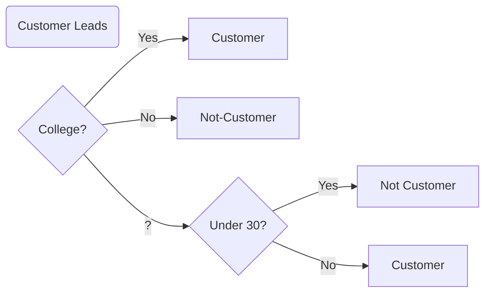

### Introduction

As always with machine learning, we start with some data that has both attributes and labels. And we use that data to predict the labels of unlabeled data.

### Our Data

For example, imagine we are in the business of selling real estate. We take a look at our past data to try to learn which leads are likely to buy in the future. We see the following past data.

| Attended College | Under Thirty | Borough   | Income | Customer |
| ---------------- | ------------ | --------- | ------ | :------: |
| ?                | Yes          | Manhattan | < 55   |    0     |
| Yes              | Yes          | Brooklyn  | < 55   |    0     |
| ?                | No           | Brooklyn  | < 55   |    1     |
| No               | No           | Queens    | > 55   |    1     |
| ?                | No           | Queens    | < 55   |    1     |
| Yes              | No           | Queens    | >55    |    0     |
| Yes              | No           | Queens    | >55    |    0     |
| Yes              | Yes          | Manhattan | >55    |    0     |

Now what we likely want to do is separate find some criteria in our leads that distinguishes our customers from our noncustomers.

### The answer

Let's just see the criteria.  And then later we'll learn how we got there.  This is the answer.

The above is called a decision tree. And it tells us how to predict if a lead will turn into a customer or not. Let's try it out on a new lead to see how we can use it to make a prediction.

| Attended College | Under Thirty | Borough   | Income |
| ---------------- | ------------ | --------- | ------ |
| ?                | No           | Manhattan | < 55   |

Looking at our decision tree, our decision tree tells us to first look at college, and because college has a value of ?, we then move to the next criteria of under thirty. Because the lead is not under thirty, we predict the lead will become a customer

